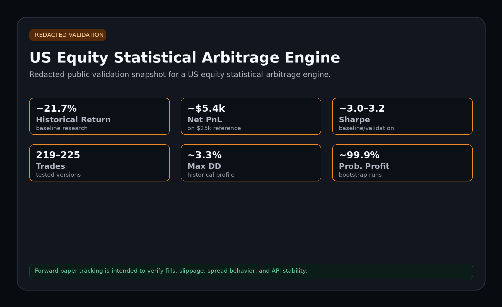
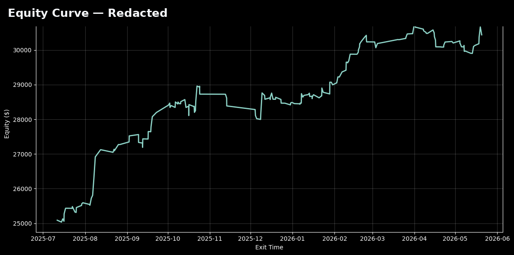

# US Equity Statistical Arbitrage Engine

A redacted public case study for a US equity statistical-arbitrage engine.

This is a public, redacted portfolio case study. It shows the research process, validation structure, and risk framework without releasing the strategy implementation.

## Maintainer

**Shikhar Agrawal**  

## Current Status

Built and historically tested. Paper/forward execution logging is underway to review fills, transaction costs, spreads, slippage, and broker/API behavior before controlled deployment.

## High-Level Strategy Concept

The engine looks for short-term statistical dislocations in liquid US equities. It uses a structured signal process, regime checks, and risk controls before entering trades.

The exact implementation is private.

## Public Validation Snapshot

| Area | Public Summary |
|---|---:|
| Historical backtest return | ~21.7% baseline research result |
| Bootstrap 5% return | ~10.1% |
| Sharpe profile | ~3.0-3.2 baseline/validation range |
| Max drawdown | ~3.3% historical profile |
| Trade count | ~219-225 across tested versions |
| Forward execution review | paper/live logging underway |

These are historical research results, not future guarantees. Forward execution logging is used to review spreads, slippage, fills, order handling, and broker/API behavior.

## Visual Assets

- `validation_snapshot.png` - US validation snapshot
- `equity_curve_redacted.png` - Equity curve
- `underwater_drawdown_redacted.png` - Underwater drawdown
- `bootstrap_distribution_redacted.png` - Bootstrap distribution
- `monte_carlo_drawdown_redacted.png` - Monte Carlo drawdown shuffle
- `parameter_stability_heatmap_redacted.png` - Parameter stability heatmap
- `robustness_summary_table.png` - Robustness summary table

## Validation Framework

- Historical backtesting
- In-sample / out-of-sample style checks
- Cost sensitivity
- Risk-control review
- Parameter stability review
- No-lookahead style audit where applicable
- Monte Carlo / path-dependency checks where applicable
- Bootstrap / resampling checks where applicable
- Forward execution logging for spreads, fills, slippage, and broker/API behavior

## Market-Specific Notes

US equities generally offer strong liquidity, but execution still needs review around bid/ask spreads, paper-fill realism, market open/close behavior, short availability, and broker/API stability.

## Risk Controls

- Hard loss control
- Break-even protection where applicable
- Trailing stop where applicable
- Time-based exits
- Session controls
- Regime filters
- Trade lockout after poor behavior where applicable
- Execution monitoring during forward tests

## What Is Not Public

- Exact tickers
- Exact parameters
- Exact signal formulas
- Source code
- Broker/API execution code
- Full trade ledger
- Raw notebooks
- Live deployment logic

## Contact & Licensing

For licensing inquiries, private demos, custom strategy work, or collaboration:

- Email: `shikhar.quant@gmail.com`

Private strategy details are not shared publicly. Any deeper review, live deployment, or custom build requires a separate written agreement.

## Disclaimer

This repository is a redacted research/portfolio case study. It is not investment advice, a solicitation to buy or sell securities, or a guarantee of future performance.
